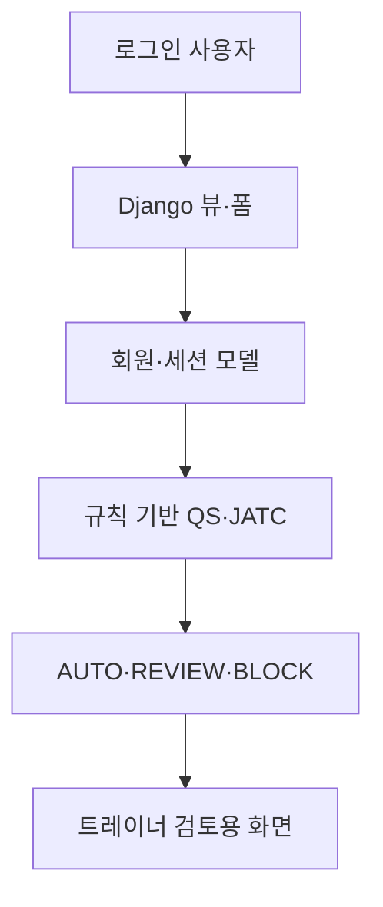

# LIGHT ONE V3 기술 아키텍처

## 목적과 현재 범위

LIGHT ONE V3는 PT 센터와 트레이너가 합성 운동상담 기록을 구조화하고, 규칙 기반 참고 지표와 검토 우선순위를 확인하는 Django 파일럿 MVP입니다. 현재 저장소는 운영 서비스, 의료기기, 자동 진단 시스템 또는 검증된 AI 모델을 제공하지 않습니다.

## 기준 컴포넌트

| 영역 | 경로 | 책임 | 상태 |
|---|---|---|---|
| 프로젝트 설정 | `lightone_v2_django/mysite/` | URL, 공통 설정, 로컬·운영 설정 분리 | 활성 |
| 계정 | `lightone_v2_django/accounts/` | 커스텀 사용자와 로그인 흐름 | 활성 MVP |
| 상담 도메인 | `lightone_v2_django/lightone/` | 세션, 규칙 기반 QS/JATC, 라우팅, 리포트 | 활성 MVP |
| 대시보드 | `lightone_v2_django/dashboard/` | 대시보드 화면 진입점 | 활성 MVP |
| 저장소 검증 | `tests/` | 문서·합성 데이터·공개 안전성 검사 | 활성 |
| 기준 문서 | `docs/` | 제품, 개인정보, 비의료 경계, 검증 기준 | canonical |
| 과거 구현 | `legacy/` 등 | 회귀 조사와 히스토리 보존 | archive |

## 요청 처리와 검토 흐름

`AUTO`, `REVIEW`, `BLOCK`은 운영상 검토 우선순위이며 질병, 부상, 운동 금기 또는 치료 필요를 판정하지 않습니다. 현재 코드의 점수 계산은 외부 AI 서비스나 학습 모델 호출이 아닌 규칙 기반 로직입니다.

## 설정과 데이터 경계

| 환경 | 설정 모듈 | 데이터 저장 | 용도 |
|---|---|---|---|
| 공통 | `mysite.settings` | SQLite 기본 정의 | 보안 기본값과 공통 구성 |
| 로컬 데모 | `mysite.settings_local` | 로컬 SQLite | 합성 데이터 기반 개발·시연 |
| 운영 구성 후보 | `mysite.settings_production` | PostgreSQL 필수 | 별도 배포 검증을 위한 구성 초안 |

- 모든 환경에서 `SECRET_KEY`가 필요하고 `DEBUG` 기본값은 `False`입니다.
- 로컬 데모만 명시적으로 `DEBUG=True`를 사용합니다.
- 실제 회원 데이터, 업로드 미디어, `.env`, SQLite DB는 공개 저장소에 포함하지 않습니다.
- 운영 설정 파일의 존재는 배포 보안 검증 완료를 의미하지 않습니다.

## 신뢰 경계와 남은 과제

1. 브라우저 입력은 서버 폼 검증과 인증 경계를 통과해야 합니다.
2. 규칙 기반 산출물은 담당 트레이너 검토 전제로만 사용합니다.
3. 운영 전 역할별 권한, 객체 수준 접근 통제, 감사 로그, 보유·파기, 백업·복구를 검증해야 합니다.
4. 실제 데이터 처리 전 개인정보 영향과 법률·비의료 표현을 별도로 검토해야 합니다.
5. 운영 환경에서 PostgreSQL, HTTPS, 비밀관리, 모니터링과 장애 대응을 통합 검증해야 합니다.

## 검증 진입점

로컬 및 CI 검증 명령은 `CONTRIBUTING.md`를 기준으로 합니다. 배포 가능 여부는 `docs/release-checklist.md`의 게이트를 모두 충족한 뒤 별도로 판단합니다.
