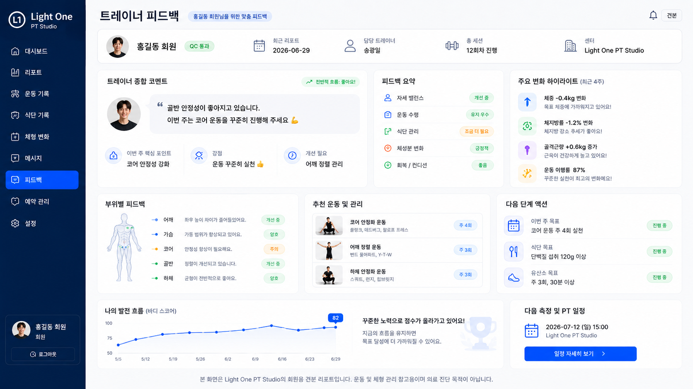
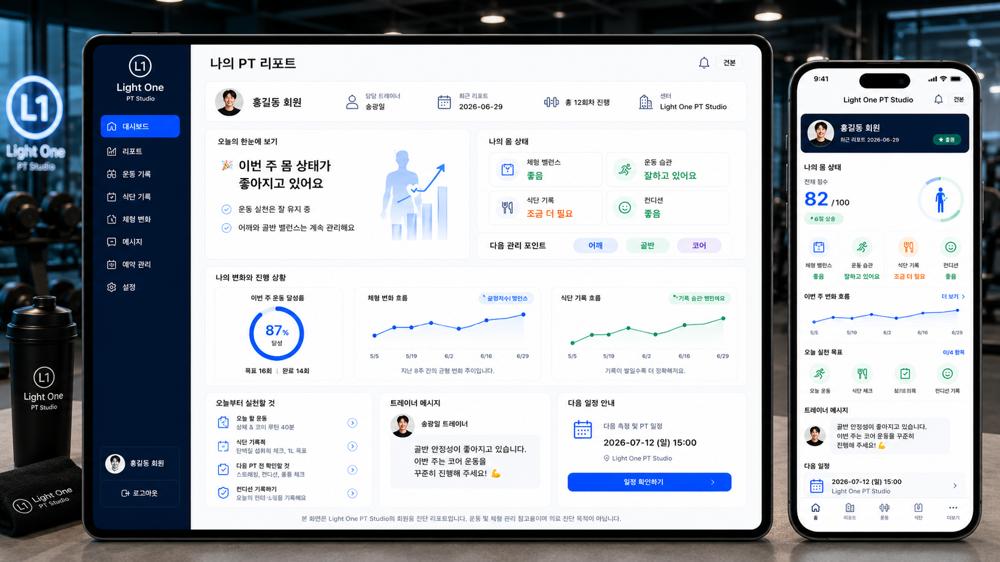
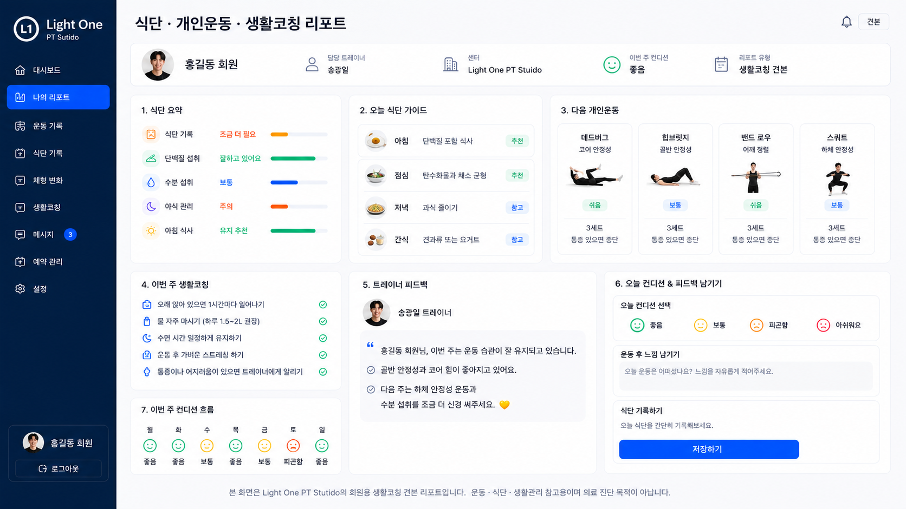
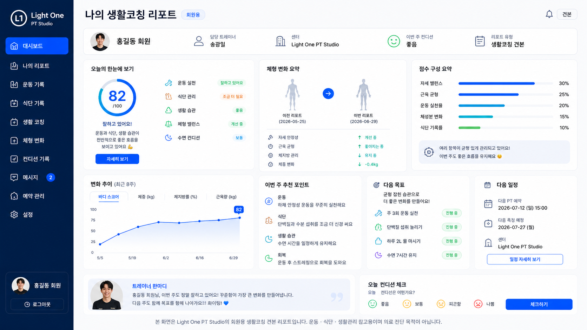
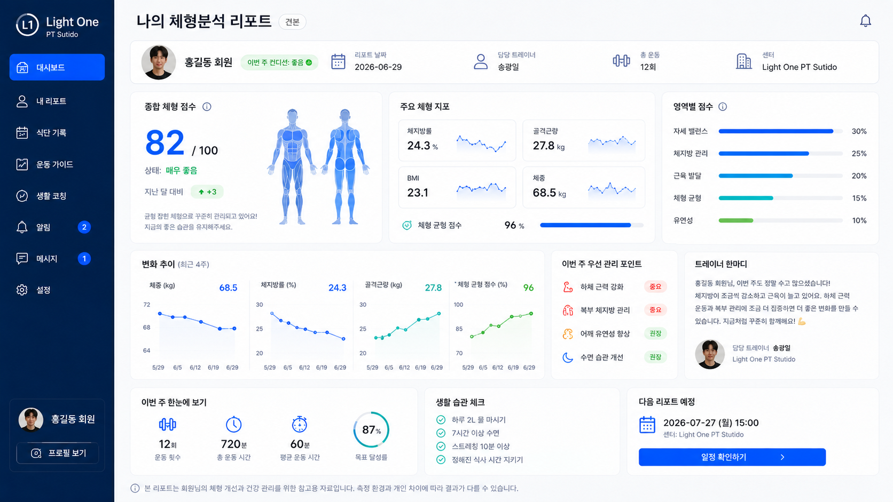
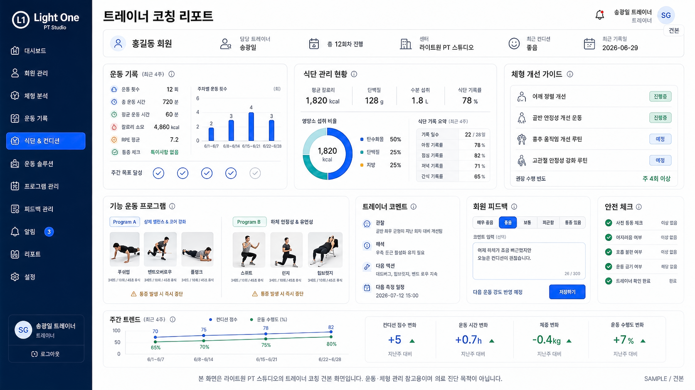
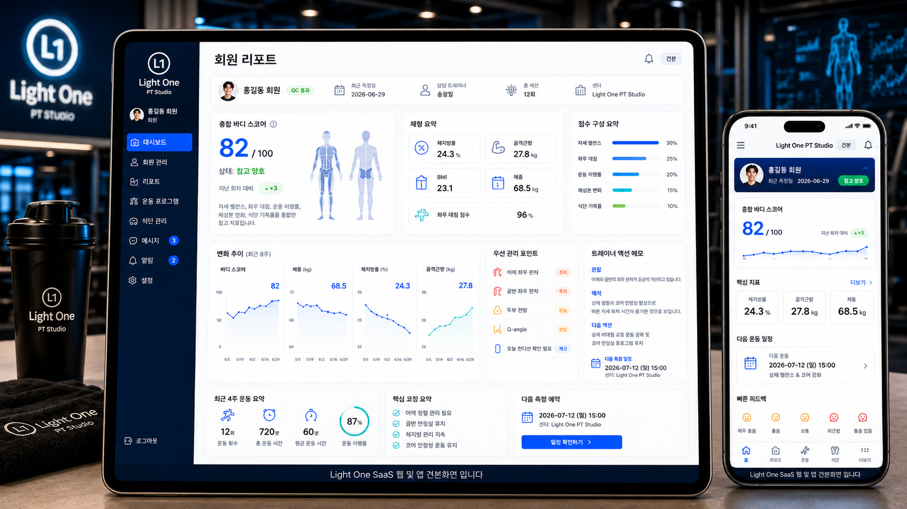
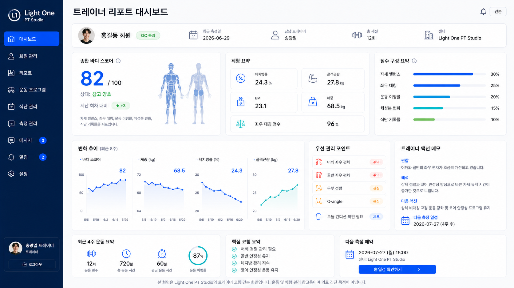
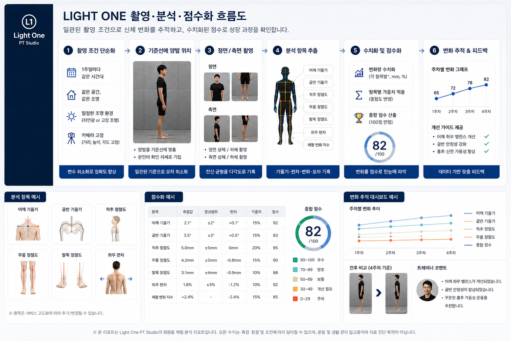

# LIGHT ONE — V1 Archive / Original Asset Repository

**Current active repository: [gggwang210-commits/LightOne_V2](https://github.com/gggwang210-commits/LightOne_V2)**

**비의료 웰니스 체형·자세 레퍼런스 서비스 — 기술 기반 + 자산 아카이브 (archive / reference only)**

> 이 저장소는 production 또는 active development 저장소가 아니며, 초기 기획 문서·이미지 자산·QC 기술 모듈 보관소입니다.
> LIGHT ONE 프로젝트의 **기술 모듈 원본**과 **초기 디자인 자산**을 archive / reference only 용도로 보관합니다.
> 사업 전략·제품 설계와 현재 개발은 [LightOne_V2](https://github.com/gggwang210-commits/LightOne_V2) 저장소를 참조하세요.

---

## 프로젝트 요약

LIGHT ONE은 PT 센터·트레이너가 회원의 체형 변화를 수치화·시각화하여 상담에 활용할 수 있도록 돕는 비의료 운동 상담 지원 서비스입니다.

V2 전환 이후 이 저장소의 기술 모듈은 **메인 상품이 아닌 신뢰도 보조 레이어(Quality Assurance Layer)**로 재배치되었습니다. 촬영 품질 판정, 조명 표준화, 센터 환경 검증 등 데이터 입력 단계의 신뢰도를 담보하는 역할을 합니다.

```
프로젝트 상태:  V1 기술 모듈 완성 → V2 사업 전략 전환
포지셔닝:       비의료 웰니스 (의료 진단·처방 목적 아님)
포즈 추정:      RTMPose (Apache 2.0) 우선 권장
```

---

## 파일럿/고객검증 문서

현재 저장소의 고객검증·파일럿 실행 문서는 [`docs/validation/pilot-validation-plan.md`](docs/validation/pilot-validation-plan.md)를 기준으로 하며, 인터뷰·체크리스트·LOI 실행 문서는 [`docs/customer-validation-interview-guide.md`](docs/customer-validation-interview-guide.md), [`docs/pilot-execution-checklist.md`](docs/pilot-execution-checklist.md), [`docs/pilot-loi-template.md`](docs/pilot-loi-template.md)를 참조하세요.

---

## 저장소 구조

```
lightone/
├── README.md
├── docs/
│   ├── ASSET_DOCUMENTATION.md              ← 대시보드 자산 문서 (10개 파일 분석)
│   └── dashboard-assets/                   ← 디자인 자산 원본 (파일명 원본 유지)
│       ├── H_dashboard1.png
│       ├── H_dashboard_2v.png
│       ├── H_dashbord2.png
│       ├── H_dashborad3.png
│       ├── H_dashborad_4.png
│       ├── T_dashboard_demo_one.png
│       ├── T_dashboard_demo_two.png
│       ├── T_dashboard_2v.png
│       ├── T_dashboard_three.png
│       └── info_plan.png
└── (기술 모듈 — 아래 §2 참조)
```

> 파일명 오타(`dashbord`, `dashborad`)는 원본 보존 목적으로 유지. 정리된 파일명은 [LightOne_V2/assets/](https://github.com/gggwang210-commits/LightOne_V2) 참조.

---

## 1. 기술 모듈

V1에서 구현된 기술 모듈과 V2에서의 역할입니다. 아래 수치형 PASS 기준은 의료 판단 기준이 아니라 촬영 품질/운동상담 참고용 운영 기준이며, 현재 데모 기준 또는 초기 가정입니다. 파일럿 데이터 확보 후 조정 예정입니다.

### 1.1 카메라 캘리브레이션

| 항목 | 내용 |
|------|------|
| 목적 | 촬영 품질 판정 PASS / CHECK / FAIL |
| 방법 | OpenCV 체커보드 기반 내부 파라미터 산출 |
| 합격 기준 | 데모 기준/초기 가정: RMSE < 0.5px PASS [확인필요] |
| 산출물 | 왜곡 보정 이미지, 재투영 오차 리포트 |
| V2 역할 | 센터 QC 파이프라인의 첫 번째 게이트 |

### 1.2 조명 정규화

| 항목 | 내용 |
|------|------|
| 목적 | 촬영 환경 간 조명 편차 제거 |
| 방법 | Gray-world 화이트밸런스 + CLAHE 히스토그램 균등화 |
| 합격 기준 | 데모 기준/초기 가정: 균일도 ≥ 90% PASS [확인필요] |
| 산출물 | 정규화 이미지 (PNG) + 조명 조건 리포트 (JSON) |
| V2 역할 | 체형 비교 데이터의 신뢰도 담보 |

### 1.3 센터 QC (3단계 Quality Gate)

| Gate | 검증 항목 |
|------|-----------|
| Gate 1 | 중심 정렬 + 전신 포함 여부 |
| Gate 2 | 배경 조건 + 바닥 마커 확인 |
| Gate 3 | 촬영 조건 종합 판정 (캘리브레이션 + 조명 + 포즈) |

### 1.4 포즈 추정 (참조 기술)

| 엔진 | 라이선스 | 비고 |
|------|----------|------|
| **RTMPose** | Apache 2.0 | V2 우선 권장 |
| MediaPipe | Apache 2.0 | 경량 대안 |
| MoveNet | Apache 2.0 | TFLite 호환 |
| OpenPose | 비상업 라이선스 | ⚠️ 상업 사용 불가 — 대체 필요 |

> 포즈 추정 기술 자체는 오픈소스/SDK로 평준화되어 있어 경쟁 해자가 아닙니다.  
> LIGHT ONE의 해자는 **현장 데이터 구조화, 컨디셔닝 방법론, 상담 보고서 UX, 트레이너 교육·인증 IP**에 있습니다.

---

## 2. 대시보드 자산 미리보기

상세 분석은 [`docs/ASSET_DOCUMENTATION.md`](docs/ASSET_DOCUMENTATION.md) 참조.

### 회원용 대시보드 (H_ 시리즈)

| 트레이너 피드백 | 나의 PT 리포트 (웹+모바일) |
|:---:|:---:|
|  |  |

| 식단·개인운동·생활코칭 | 나의 생활코칭 리포트 |
|:---:|:---:|
|  |  |

| 나의 체형분석 리포트 |
|:---:|
|  |

### 트레이너용 대시보드 (T_ 시리즈)

| 트레이너 리포트 대시보드 | 트레이너 코칭 리포트 |
|:---:|:---:|
|  |  |

| 회원 리포트 (웹+모바일) | 트레이너 리포트 대시보드 (2) |
|:---:|:---:|
|  |  |

### 서비스 흐름도

| LIGHT ONE 촬영·분석·점수화 흐름도 |
|:---:|
|  |

---

## 3. V1 → V2 전환 요약

| 구분 | V1 (이 저장소) | V2 |
|------|----------------|-----|
| 핵심 | AI 체형분석 기술 | PT 상담 보고서 SaaS |
| 기술 역할 | 메인 상품 | 신뢰도 보조 레이어 |
| 대시보드 | 원본 자산 (파일명 원본 유지) | 정리된 자산 (카테고리별 분류) |
| 비즈니스 | D2C 앱 지향 | B2B 센터·트레이너·기업 |
| 핵심 해자 | 포즈 추정 정확도 | 방법론 IP + 상담 UX + 교육·인증 |

전환 배경과 전략 상세는 [LightOne_V2 README](https://github.com/gggwang210-commits/LightOne_V2) 참조.

---

## 4. 견본 데이터 스펙

모든 대시보드 화면이 공유하는 데모 데이터입니다. 아래 점수와 비율은 확정 성능·품질 기준이 아니라 화면 검증용 데모 수치이며, 의료 판단 기준이 아닌 운동상담 참고용 예시입니다. 파일럿 데이터 확보 후 조정 예정입니다.

| 항목 | 값 |
|------|-----|
| 회원 | SYN-001 |
| 트레이너 | 데모 트레이너 |
| 센터 | Light One PT Studio |
| 최근 측정일 | 2026-06-29 |
| 총 세션 | 12회차 |
| 종합 바디 스코어 | 데모 수치: 82 / 100 [확인필요] |
| 체지방률 | 24.3% |
| 골격근량 | 27.8 kg |
| BMI | 23.1 |
| 체중 | 68.5 kg |
| 좌우 대칭 점수 | 데모 수치: 96% [확인필요] |
| 운동 이행률 | 데모 수치: 87% (14/16회) [확인필요] |

---

## 5. 관련 저장소

| 저장소 | 역할 | 링크 |
|--------|------|------|
| **lightone** (이 저장소) | 기술 모듈 원본 + 자산 아카이브 | — |
| **LightOne_V2** | 사업 전략 + 정리된 자산 + 로드맵 | [GitHub](https://github.com/gggwang210-commits/LightOne_V2) |

---

## 기술 문서

- [기술 구조 요약](docs/architecture.md): 현재 구현 범위, 데이터 흐름, 실행 방법, 품질 판단 기준, 미구현 범위, 안전·개인정보 경계를 정리한 문서
- [안전 정책](docs/safety-policy.md): 비의료 참고 정보, 개인정보 보호, Human-in-the-loop 원칙 정리
- [기술 로드맵](docs/roadmap.md): 규칙 기반 MVP에서 ML 및 자세 인식 실험으로 확장하는 단계별 계획

---

## 안전 및 포지셔닝

본 서비스는 **비의료 웰니스** 영역에 해당합니다.

- 의료적 판단으로 오인될 수 있는 표현은 사용자 화면에서 사용하지 않거나 `[확인필요]`로 표시합니다.
- 금지·검토 대상 표현은 `docs/governance/non-medical-boundary.md`에서 관리합니다.
- 모든 화면 하단에 면책 문구 표시: "운동 및 체형 관리 참고용이며 비의료 상담 보조 자료입니다."
- 의학적 판단이 필요한 경우 관련 자격을 갖춘 전문가의 판단이 우선합니다

---

## 라이선스

본 저장소의 디자인 자산은 LIGHT ONE 프로젝트 내부 사용 목적으로 제작되었습니다. 기술 모듈의 의존 라이브러리 라이선스는 각 모듈 디렉토리의 LICENSE 파일을 참조하세요.

---

*LIGHT ONE — 비의료 웰니스 체형·자세 레퍼런스 서비스*
